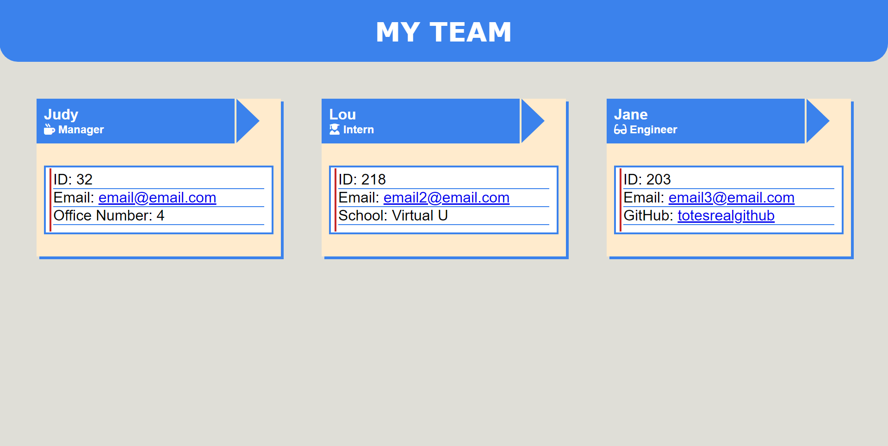

# Team Profile Generator 

## Description

This is a light-weight profile generator that utilizes the Inquirer.js UI to create a static HTML page of a team through the command line. There is a total of four different roles, which can be used more than once in the answering process.

The HTML and CSS are both premade and only visibly accessible after finishing the Inquirer process.

## Usage

`npm i`

`node index.js`

## Bugs

Due to an mapping error, it is advised to go in order of Manager -> Intern or Engineer. Any other order or running the add Manager command after the latter will cause the HTML to be formatted incorrectly and make the cards nest within each other.

## Testing

All testing of the classes was handled through **Jest**. There is a total of 9 tests across all of the team classes, and can be accessed and used through the command:

`npm run test`

Make sure to have run `npm i` before attempting to run the command.

## Documentation
